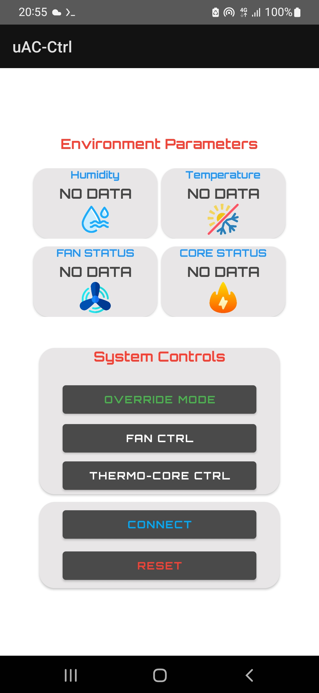
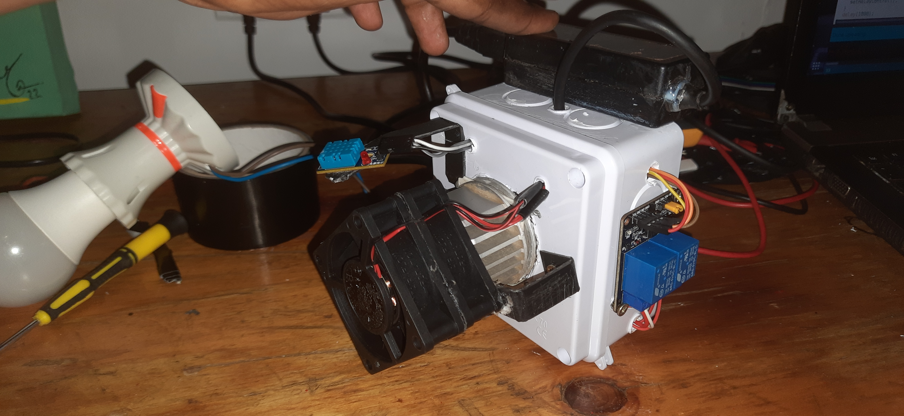

# Thermo-Core-Unit

- A project I did for making a portable heater unit that can be used for room climate control

## Project Components

1. **Peltier Heatsink Assembly**: The project utilizes a Peltier heatsink assembly, which can both heat and cool, depending on the direction of the current.

2. **DHT11 Sensor**: The DHT11 sensor measures temperature and humidity.

3. **OLED Display**: An OLED display for monitoring temperature and humidity data.

4. **2-Channel Relay System**: Two relays control the heater element and lamp.

## Setup

1. **Hardware Setup**: Connect the components as per your hardware setup. Ensure the Peltier heatsink assembly, DHT11 sensor, OLED display, and relays are wired correctly to the controlling microcontroller (not provided in the code).

2. **Code Customization**: Adjust the following parameters in the provided code to match your setup:
   - `OVERRIDE_STATE`: Set to `true` to override automatic temperature regulation.
   - `TEMP_THRESHOLD`: Set the desired temperature threshold for the Peltier heater assembly.

3. **Upload Code**: Compile and upload the code to your microcontroller. Verify that it supports the necessary libraries for DHT11, OLED, and relay control.

4. **Power Supply**: Ensure that the Peltier heatsink assembly has a suitable power supply

## Features

1. **Monitoring**: Once the code is uploaded, the OLED display will show real-time temperature and humidity data. The top row displays "Modular Heating," and the bottom row shows temperature (*C) and threshold values.

2. **Automatic Temperature Control**: By default, the system will control the Peltier heater assembly and relays based on the `TEMP_THRESHOLD`. If the current temperature exceeds the threshold, the heater and fans will turn on.

3. **Manual Override**: To override automatic control, set `OVERRIDE_STATE` to `true`. This will disable automatic regulation, allowing you to control the heater and fans manually.

## Media

- Remote control app
[

- Prototype Video

